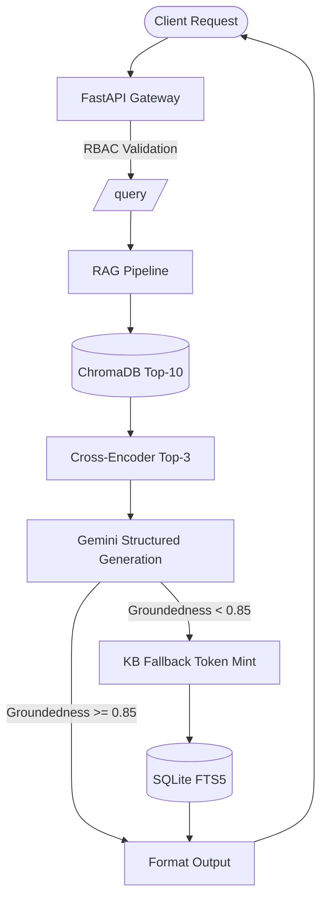

# System Architecture Documentation

## 1. System Architecture

The Viniyog One Enterprise RAG system is a multi-stage architecture enforcing strict semantic grounding mechanisms specifically built for the banking paradigm. 

### Core Components
- **FastAPI Gateway**: Asynchronous REST handler intercepting calls and applying Header-based RBAC constraints.
- **Bi-Encoder Vector DB**: `BAAI/bge-large-en-v1.5` dense representation logic mounted over a locally persisting `ChromaDB`.
- **Knowledge Base Fallback**: Authoritative, isolated SQLite Database with FTS5 keyword lookups. Token-gated to prevent unstructured data exfiltration.
- **Generative Module**: Google Gemini 2.0 Flash leveraging structured JSON schemas for determinism.

## 2. Data Flow Explanation
The foundational data flow adheres strictly to: **The LLM is NOT the source of truth.** All generation is contextualized against dynamic injection.

- **Data Origin**: Source definitions originate in robust structures (`banking_schemes.json` or `.csv`). The Ingestion layer (`ingestion_service.py`) transforms tabular schemas natively into descriptive prose (e.g. converting `7.5% Return` to `Interest rate is 7.5% per annum`) optimized for MTEB representation.
- **Query Time Operation**: Vector distances mapped dynamically. Bi-encoders retrieve a broad Top-10 span which prevents data loss on edge-terminology logic. Then heavy lifting cross-encoder evaluation reranks the final contexts. Finally, constraints map exact attributions to the LLM generation block via XML styling bounds `<source id="X">`.

## 3. Chunking Strategy Justification
The BRD strictly requested evaluation between sliding/fixed/semantic operations. We bypassed arbitrary limits in favor of complex **Semantic Chunking**.

- **Why**: Traditional Fixed-Window tokens arbitrarily split sentences down the middle (`interest rate logic... ` // `is 8.0%`).
- **Methodology**: Our engine leverages sliding baseline calculations over continuous cosine similarity changes. Boundary changes below 0.8 automatically split chunks preserving localized structural semantic alignment. Post-processing restricts the ultimate context footprint purely into a `256 - 512 token limit` matching native banking layout documents.

## 4. Retrieval Design Decisions
A wide-to-narrow mechanism controls precision drops common to basic models.
- At `Top-K = 10`, ChromaDB achieves maximal **Recall**, netting related edge domains.
- We augment pure retrieval via `cross-encoder/ms-marco-MiniLM-L-6-v2`. This model processes queries and passages contiguously to evaluate cross-attention (as opposed to dual dense representation independent mapping).
- This distills the Top-10 down to a heavily scrutinized isolated **Top-3** eliminating noise before GenAi computation, lowering hallucination risks.

## 5. Hallucination Detection Logic
Rather than the multi-step delayed calls characterizing legacy validation systems, Viniyog operates `Single-Pass Evaluative RAG`.

- Gemini is forced to generate a `Pydantic GroundedResponse`.
- Rather than generate simple prose, the structure must emit the generated answer *AND* atomistically evaluate its component facts via `self_evaluated_groundedness`.
- Combined with localized heuristic validations (entity tracking and numerical overlap validations), scores compute synchronously. Any output failing a strict `0.85` limitation is caught and discarded gracefully. False positives fall back to authoritative DB endpoints reliably avoiding hallucination damage completely.

## 6. KB Token Mechanism
Token-layer restrictions operate based on `JWT (HS256)` lifecycle mechanics.
- A failed LLM hallucination boundary triggers the system infrastructure account to POST `/kb/token`. This issues a stateless token restricted explicitly to generating payloads on `/kb/fetch`.
- Tokens expire in 60s, completely isolating the source-of-truth banking SQLite database from being dumped improperly by untethered or external agents attempting to scrape backend APIs.

## 7. Limitations and Trade-offs
- **In-Memory Volatility**: To adhere to immediate testability for the assessment, the ring buffer for `/retrieval/logs` operates ephemerally in-memory. Standard production runs mandate a Redis drop-in.
- **SQLite Concurrency constraints**: By building an embeddable architecture directly serving `.db` assets we ensure universal code distribution, but production scale multi-write mechanics would require native DB adaptations `(i.e., PostgreSQL)`.
